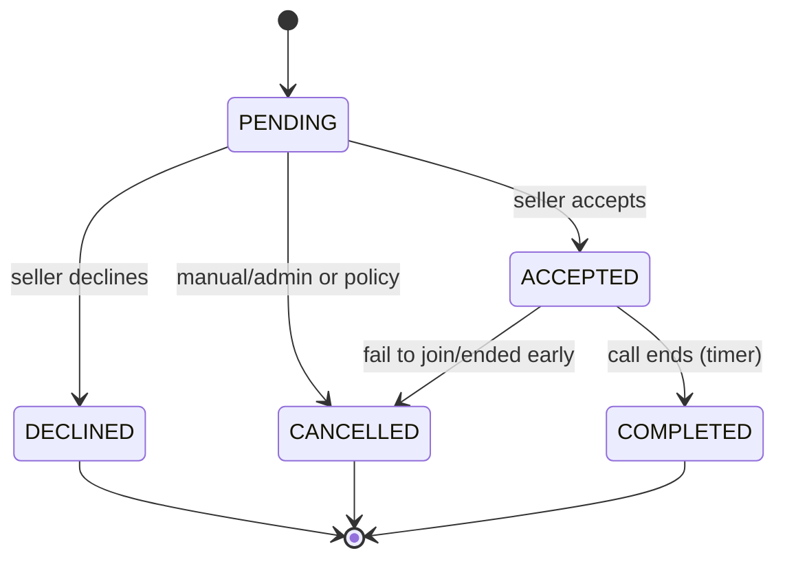
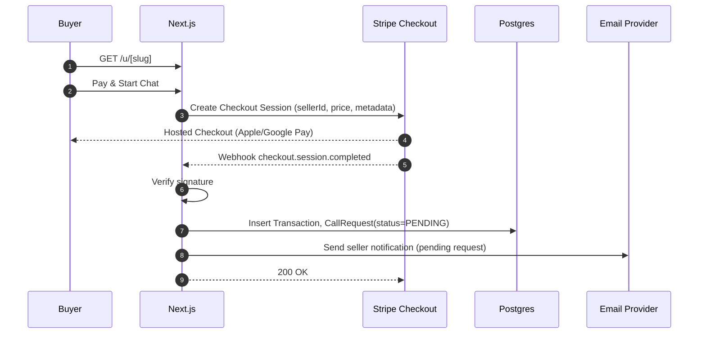
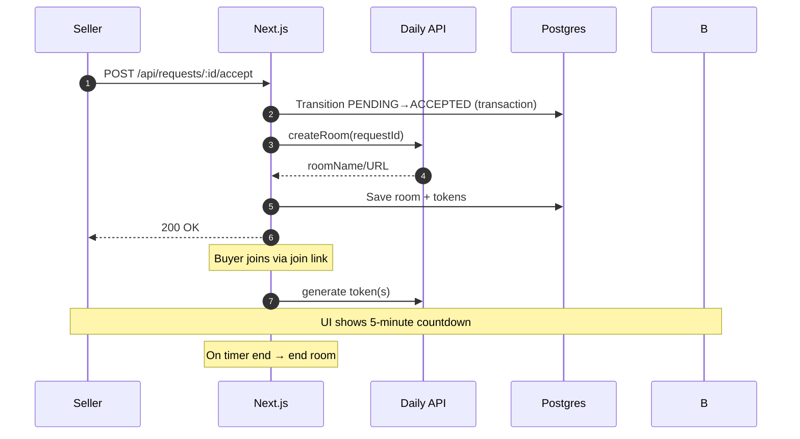

# ChatLink Architecture v0.1 — Sharded Index

This document has been sharded into focused files under `docs/architecture/` for easier navigation and maintenance. Use the links below to jump to specific areas.

- Overview: `docs/architecture/overview.md`
- Tech Stack: `docs/architecture/tech-stack.md`
- High-Level Architecture: `docs/architecture/system-architecture.md`
- Key Flows (narrative): `docs/architecture/key-flows.md`
- Data Model (Prisma): `docs/architecture/data-model.md`
- Routes & Handlers: `docs/architecture/routes.md`
- Services (Domain Modules): `docs/architecture/services.md`
- Security & Compliance: `docs/architecture/security-compliance.md`
- Observability & Ops: `docs/architecture/observability-ops.md`
- Configuration (ENV): `docs/architecture/configuration.md`
- Deployment: `docs/architecture/deployment.md`
- Vertical Slices (MVP): `docs/architecture/vertical-slices.md`
- Risks & Mitigations: `docs/architecture/risks-mitigations.md`
- Testing Strategy: `docs/architecture/testing-strategy.md`
- State Model: `docs/architecture/state-model.md`
- Key Sequences (mermaid): `docs/architecture/sequences.md`
- FR/NFR Traceability: `docs/architecture/traceability.md`
- Performance & Accessibility Budgets: `docs/architecture/performance-accessibility.md`
- Idempotency, Rate Limits, and Safety: `docs/architecture/idempotency-safety.md`
- UI Foundation: `docs/architecture/ui-foundation.md`

Source PRD: `docs/prd.md`

# ChatLink Architecture v0.1

## Overview

ChatLink is a Next.js monolith that enables paid, time-boxed video calls. Buyers visit a seller’s public paywall, pay via Stripe Checkout, and—on payment—both parties join a 5-minute video room (Daily.co by default; Agora optional). Sellers manage profiles, requests, balances, and payouts in a single dashboard. The initial focus is speed to MVP with a modular, secure foundation.

## Tech Stack

- Framework: Next.js (App Router), TypeScript, React Server Components + Server Actions where appropriate
- Runtime: Node.js (Vercel or Node-compatible host); Stripe webhook uses Node runtime (not Edge)
- Database: PostgreSQL (Neon/Supabase/Railway)
- ORM: Prisma
- Auth: Email + password (bcrypt) via custom credentials flow; sessions via JWT or DB-backed session with Prisma
- Payments: Stripe Checkout + Webhooks
- Video: Daily.co (default) via REST + daily-js; switchable provider interface (Agora later)
- Email: Resend or Postmark (transactional emails)
- Observability: Structured logs (pino), error tracking (Sentry), minimal metrics (payment success/failure, calls started/ended)
- Storage: S3-compatible for profile photos (if not using provider CDN)

## High-Level Architecture

```
[Browser]
  ├─ Public Paywall (/u/[slug]) → POST /api/payments/checkout → Stripe Checkout
  ├─ Video Room UI (daily-js) ← room token/URL from /api/video/join
  └─ Seller Dashboard (auth required)

[Next.js App]
  ├─ Pages/Routes (RSC + handlers)
  ├─ API Route Handlers
  │   ├─ /api/auth/* (signup, login, logout, reset)
  │   ├─ /api/profile/* (CRUD)
  │   ├─ /api/payments/checkout (create Stripe session)
  │   ├─ /api/webhooks/stripe (webhook endpoint)
  │   ├─ /api/requests/* (list/accept/decline)
  │   ├─ /api/video/* (create/join/end)
  │   ├─ /api/payouts/* (request/update)
  │   └─ /api/admin/* (reports, users minimal)
  ├─ Services (domain modules: auth, payments, video, notifications, requests)
  └─ Data Access (Prisma models)

[Stripe]
  ├─ Checkout Session → redirect to app
  └─ Webhook → /api/webhooks/stripe (create CallRequest)

[Daily.co]
  ├─ REST: room create/end
  └─ Client SDK: daily-js join, events

[Email Provider]
  └─ Send transactional emails (request created, accepted/declined)

[PostgreSQL]
  └─ Users, Profiles, Requests, Transactions, Payouts, Ratings, Blocks, Reports, EventLog
```

## Key Flows

- Buyer Payment → Call Request
  - GET /u/[slug] renders paywall with seller info and price.
  - Buyer clicks Pay; server creates Stripe Checkout Session with amount from seller price and metadata (sellerId, slug, requestId placeholder or will create on webhook).
  - Stripe redirects back to success URL; authoritative creation happens in webhook: on `checkout.session.completed`, app creates Transaction + CallRequest (pending), computes platform fee and net.
  - Email sent to seller notifying a pending request.

- Seller Accept/Decline → Room Admission
  - Seller dashboard lists pending requests; accept triggers video.createRoom() (Daily) and generates join tokens for buyer and seller; status → accepted; email buyer join link if needed.
  - Decline sets status → declined; refund/cancel policy TBD (record intent; manual refund acceptable in MVP).

- Join & 5-Minute Limit
  - Both parties hit /api/video/join to fetch room URL/token; UI shows countdown starting when both join (client-observed events). On timer end, UI calls /api/video/end; server attempts to end room via provider.
  - For MVP, enforcement is client-driven with server room end; provider-level enforcement can be added with room TTL/exp.

- Payouts (Manual MVP)
  - Seller requests payout; record PayoutRequest with amount snapshot; admin marks processed with reference. No Stripe Connect in MVP; funds settle to platform, payouts are manual off-platform.

## Data Model (Prisma Sketch)

```prisma
model User {
  id            String   @id @default(cuid())
  email         String   @unique
  passwordHash  String
  role          Role     @default(SELLER)
  createdAt     DateTime @default(now())
  updatedAt     DateTime @updatedAt
  profile       Profile?
  requests      CallRequest[] @relation("SellerRequests")
  blocks        Block[] @relation("SellerBlocks")
  reports       Report[] @relation("SellerReports")
}

enum Role { BUYER SELLER ADMIN }

model Profile {
  id         String   @id @default(cuid())
  userId     String   @unique
  slug       String   @unique
  displayName String
  bio        String?
  photoUrl   String?
  priceCents Int      @default(1000) // $10 default
  createdAt  DateTime @default(now())
  updatedAt  DateTime @updatedAt
  user       User     @relation(fields: [userId], references: [id])
}

model Transaction {
  id             String   @id @default(cuid())
  stripeSessionId String  @unique
  stripePaymentIntentId String?
  sellerId       String
  grossCents     Int
  platformFeeCents Int
  netCents       Int
  currency       String   @default("usd")
  createdAt      DateTime @default(now())
}

model CallRequest {
  id         String   @id @default(cuid())
  sellerId   String
  buyerEmail String
  transactionId String
  status     RequestStatus @default(PENDING)
  roomName   String?
  roomUrl    String?
  buyerToken String?
  sellerToken String?
  createdAt  DateTime @default(now())
  updatedAt  DateTime @updatedAt
  acceptedAt DateTime?
  declinedAt DateTime?
  endedAt    DateTime?
}

enum RequestStatus { PENDING ACCEPTED DECLINED CANCELLED COMPLETED }

model PayoutRequest {
  id        String   @id @default(cuid())
  sellerId  String
  amountCents Int
  status    PayoutStatus @default(REQUESTED)
  createdAt DateTime @default(now())
  processedAt DateTime?
}

enum PayoutStatus { REQUESTED PROCESSED }

model Rating {
  id         String   @id @default(cuid())
  callRequestId String @unique
  stars      Int
  createdAt  DateTime @default(now())
}

model Block {
  id         String   @id @default(cuid())
  sellerId   String
  buyerEmail String
  createdAt  DateTime @default(now())
}

model Report {
  id         String   @id @default(cuid())
  sellerId   String
  callRequestId String?
  buyerEmail String?
  reason     String
  createdAt  DateTime @default(now())
}

model PasswordResetToken {
  token     String   @id
  userId    String
  expiresAt DateTime
  createdAt DateTime @default(now())
}

model EventLog {
  id        String   @id @default(cuid())
  type      String
  refId     String?
  payload   Json?
  createdAt DateTime @default(now())
}
```

Notes:
- Buyers are not stored as first-class users in MVP; we record buyerEmail on requests/transactions only. Can evolve later.
- Platform fee defaults to 20%; set via env var.

## Routes & Handlers (App Router)

- Public
  - GET `/` Landing
  - GET `/u/[slug]` Paywall (SSR). Server action to start checkout.
  - GET `/success` Payment success page
  - GET `/cancel` Payment canceled page

- Auth
  - POST `/api/auth/signup` { email, password }
  - POST `/api/auth/login` { email, password }
  - POST `/api/auth/logout`
  - POST `/api/auth/forgot` { email }
  - POST `/api/auth/reset` { token, newPassword }

- Seller (authenticated)
  - GET `/dashboard` Overview, pending requests, balance
  - GET `/profile` + POST `/api/profile` CRUD
  - GET `/requests` + POST `/api/requests/[id]/accept|decline`
  - POST `/api/payouts/request`

- Payments
  - POST `/api/payments/checkout` Creates Stripe Checkout session
  - POST `/api/webhooks/stripe` Webhook endpoint (raw body required)

- Video
  - POST `/api/video/create` Create room for accepted request
  - POST `/api/video/join` Exchange for token/URL
  - POST `/api/video/end` End room (server requests provider)

- Admin (minimal)
  - GET `/admin/reports`
  - POST `/api/admin/reports/[id]/resolve`

## Services (Domain Modules)

- AuthService: signup/login (bcrypt), reset tokens, session issuance, RBAC guards
- ProfileService: slug generation (collision-checked), price validation, photo upload
- PaymentService: Stripe session creation, fees calculation, webhook verification, transaction recording
- RequestService: create on webhook, list/filter, accept/decline transitions, idempotency
- VideoService: provider-agnostic interface (createRoom, joinTokens, endRoom); Daily implementation
- NotificationService: email templates and send (request created, accepted/declined)
- PayoutService: request/mark processed, export ledger
- AuditService: append EventLog entries for auth, payments, requests, video lifecycle

## Security & Compliance

- Auth: bcrypt hashed passwords, minimum complexity, lockout/backoff on failed attempts
- Sessions: HttpOnly secure cookies; CSRF protection on state-changing endpoints
- RBAC: roles SELLER/ADMIN; buyers unauthenticated (email only); protect server actions with middleware
- PII: store minimal PII (emails only), profile content provided by sellers
- Transport: HTTPS-only; HSTS via host
- Secrets: environment variables via platform; no secrets in client
- Stripe: use Checkout (no raw card data); verify webhook signatures; keep webhook route on Node runtime
- Video: limit rooms to 2 participants; tokens scoped per call; end room after duration
- Safety: block list checks on paywall and before creating checkout session
- Logging: structured logs with redaction for PII; audit critical events
- Privacy: basic GDPR paths (export/delete on request), privacy policy page

## Observability & Ops

- Logging: pino transport to stdout; attach requestId, userId when available
- Errors: Sentry SDK for server/client error capture
- Metrics: counters for checkout started/completed, webhook errors, calls started/ended, accept/decline
- Health: `/api/health` returns 200 with build info
- CI/CD: GitHub Actions run `typecheck`, `lint`, `prisma validate`, and unit tests; auto-deploy main to staging/prod

## Configuration (ENV)

- `DATABASE_URL` Postgres connection
- `STRIPE_SECRET_KEY`, `STRIPE_WEBHOOK_SECRET`
- `PLATFORM_FEE_BPS` default 2000 (20%) or `PLATFORM_FEE_PCT` 0.20
- `CALL_DURATION_SECONDS` default 300
- `APP_URL` canonical app host
- `DAILY_API_KEY` (or AGORA_* credentials if swapped)
- `EMAIL_FROM`, `EMAIL_PROVIDER_API_KEY`
- `SENTRY_DSN` (optional)

## Deployment

- App Hosting: Vercel (Next.js). Ensure webhook route uses Node runtime and raw body parsing (Edge incompatible).
- Database: Neon/Supabase managed Postgres
- Media: Vercel static for assets; S3-compatible for user photos if needed
- Domain: `chatlink.me` + seller links at `/u/[slug]`
- Webhooks: Configure Stripe webhook to `POST https://<app>/api/webhooks/stripe`

## Vertical Slices (MVP)

1) Epic 1 – App Skeleton & Deploy
- Landing page, health route, CI/CD to staging/prod

2) Epic 1.2 – Email/Password Auth
- Signup/login/logout; forgot/reset password; session middleware

3) Epics 2.1 + 2.2 – Profile & Link
- Profile CRUD, slug generation, public paywall SSR route

4) Epics 3.1 + 3.2 – Paywall → Stripe → Request
- Checkout session creation; webhook → Transaction + CallRequest; seller email

5) Epic 4.1 + 4.2 – Accept/Join/Timer
- Accept/decline; create room; join tokens; 5-minute timer; end room

6) Epic 5 – Balance & Payouts (Manual)
- Balance computations; PayoutRequest flow; admin mark processed

7) Epic 6 – Safety/Notifications/Feedback
- Block/Report; email event notifications; buyer star rating

## Risks & Mitigations

- Webhook fragility: implement idempotency and retries; log failures
- Timer enforcement: initial client-driven; add provider TTL or server-scheduled end later
- Payouts without Connect: manual reconciliation risk; maintain exportable ledger
- Abuse/Spam: add basic rate limits, captcha on paywall if abused
- Privacy: ensure unsubscribe/manage notifications; transactional emails only by default

## Testing Strategy (High-Level)

- Unit: services (payments calc, slug gen, state transitions)
- Integration: webhook handler (signature verification, DB writes), auth flows
- E2E: critical paths (paywall→checkout→webhook→accept→join→timer end)
- NFR checks: page load budget on paywall, accessibility checks (axe)

---

This architecture aligns to the PRD goals, keeps MVP scope tight, and allows swapping video providers and evolving payouts (Stripe Connect) without major rewrites.


## State Model

CallRequest lifecycle aligns with FR10–FR14. Concurrency is enforced via transactional updates (only transition from PENDING).



Transition rules:
- PENDING → ACCEPTED: create room, issue tokens, send notifications, set `acceptedAt`.
- PENDING → DECLINED: mark `declinedAt`; record refund/cancel intent (manual in MVP).
- ACCEPTED → COMPLETED: timer elapses or either party ends; set `endedAt`.
- Any invalid transition is rejected (idempotent handlers).

## Key Sequences

Payment → Request creation (FR6–FR9):



Accept → Join → Timer (FR10–FR13):



## FR/NFR Traceability (Concise)

- FR1–FR3: AuthService, ProfileService; routes under `/api/auth/*`, `/api/profile`.
- FR4–FR8: Profile price config; PaymentService computes fee/net; Transaction model.
- FR9–FR12: Webhook creates CallRequest; RequestService accept/decline; VideoService for room and timer.
- FR13–FR14: Video UI controls via daily‑js; Block/Report models and Admin routes.
- FR15–FR16: Balance from Transactions; PayoutService and PayoutRequest model (manual MVP).
- FR17–FR19: NotificationService emails; Admin minimal for reports; role‑based access.
- FR20: EventLog via AuditService for key events.
- NFR1: Stripe Checkout + webhook verification; no raw PAN.
- NFR2–NFR3: Health route + perf budgets; SSR paywall targeting <2s LCP on 4G.
- NFR4–NFR5: RBAC, encryption, privacy policy and delete/export flow.
- NFR6–NFR7: Accessibility checks (axe) and modern browsers; responsive.
- NFR8–NFR10: Logs/metrics, managed services, env-configurable fee/duration.

## Performance & Accessibility Budgets

- Paywall SSR TTFB: < 500 ms (staging on typical region)
- Paywall LCP (4G, mid-tier device): < 2.0 s
- Bundle hygiene: avoid client JS on paywall beyond essentials; prefer RSC
- Accessibility: automated checks pass (axe), keyboard nav complete, color contrast AA

## Idempotency, Rate Limits, and Safety

- Webhooks: idempotent by `stripeSessionId`; ignore duplicates gracefully.
- Accept/Decline: single-writer semantics via DB transaction on PENDING state.
- Rate limiting: login, password reset, webhook to prevent abuse.
- Block checks: enforce at paywall and before creating Checkout; short‑circuit with friendly message.
- Refund policy: on decline, mark for manual refund (record reference for reconciliation).
