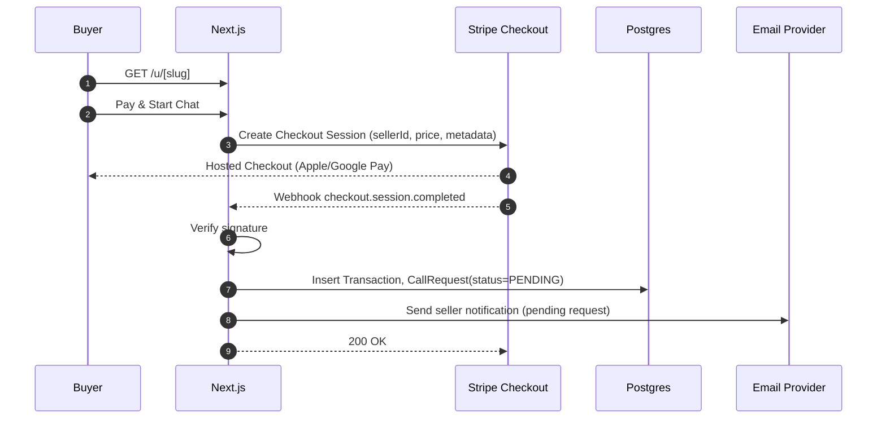
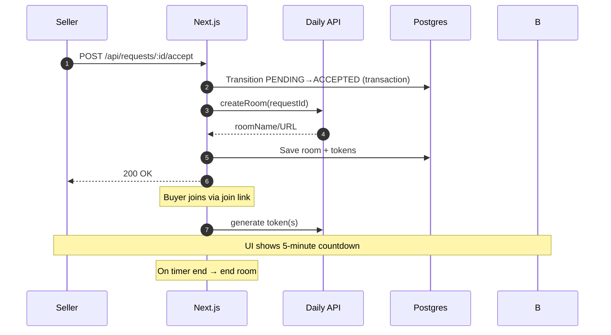

# Key Sequences

## Payment → Request creation (FR6–FR9)

```mermaid
sequenceDiagram
    autonumber
    participant B as Buyer
    participant App as Next.js
    participant Stripe as Stripe Checkout
    participant DB as Postgres
    participant E as Email Provider
    B->>App: GET /u/[slug]
    B->>App: Pay & Start Chat
    App->>Stripe: Create Checkout Session (sellerId, price, metadata)
    Stripe-->>B: Hosted Checkout (Apple/Google Pay)
    Stripe-->>App: Webhook checkout.session.completed
    App->>App: Verify signature
    App->>DB: Insert Transaction, CallRequest(status=PENDING)
    App->>E: Send seller notification (pending request)
    App-->>Stripe: 200 OK
```

## Accept → Join → Timer (FR10–FR13)

```mermaid
sequenceDiagram
    autonumber
    participant S as Seller
    participant App as Next.js
    participant Video as Daily API
    participant DB as Postgres
    S->>App: POST /api/requests/:id/accept
    App->>DB: Transition PENDING→ACCEPTED (transaction)
    App->>Video: createRoom(requestId)
    Video-->>App: roomName/URL
    App->>DB: Save room + tokens
    App-->>S: 200 OK
    Note over App: Buyer joins via join link
    App->>Video: generate token(s)
    Note over B,S: UI shows 5‑minute countdown
    Note over App: On timer end → end room
```

