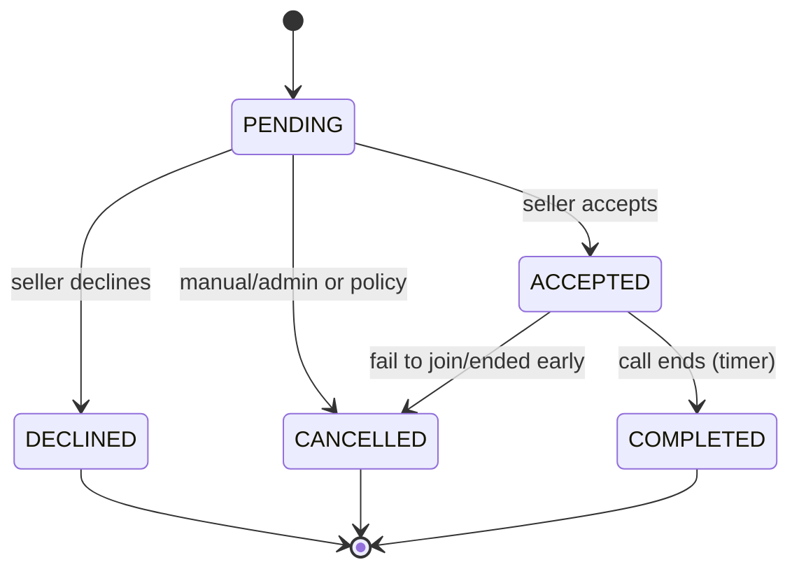

# State Model

CallRequest lifecycle aligns with FR10–FR14. Concurrency is enforced via transactional updates (only transition from PENDING).

Transition rules:
- PENDING → ACCEPTED: create room, issue tokens, send notifications, set `acceptedAt`.
- PENDING → DECLINED: mark `declinedAt`; record refund/cancel intent (manual in MVP).
- ACCEPTED → COMPLETED: timer elapses or either party ends; set `endedAt`.
- Any invalid transition is rejected (idempotent handlers).

